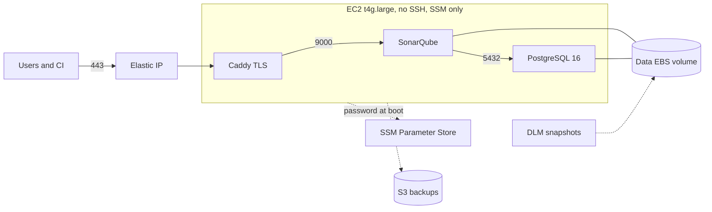

# sonarqube-selfhosted

[](https://github.com/vynazevedo/sonarqube-selfhosted/actions/workflows/ci.yml)
[](https://github.com/vynazevedo/sonarqube-selfhosted/releases)
[](LICENSE)

Production-ready, self-hosted SonarQube Community Build for your GitHub org. One `terraform apply` gives you `https://sonar.yourdomain.com` on AWS with TLS, backups, snapshots and no SSH surface. A compose-only path is included for any other host.



## Features

- Single instance, low cost (~USD 60/month), sized for small and mid-sized orgs
- Automatic HTTPS via Caddy and Let's Encrypt, security headers included
- Database password generated by Terraform, delivered via SSM Parameter Store, never in tfvars or user data
- No SSH: SSM Session Manager only, IMDSv2 required, encrypted gp3 volumes
- State on a dedicated EBS volume: instance replacement and upgrades keep all data
- Daily pg_dump to S3 plus daily EBS snapshots (DLM), automatic instance recovery alarm
- PostgreSQL never exposed; only Caddy publishes ports 80/443

## Quickstart (Terraform)

Prerequisites: a domain you control and AWS credentials.

```bash
git clone https://github.com/vynazevedo/sonarqube-selfhosted.git
cd sonarqube-selfhosted/terraform/examples/complete
terraform init
terraform apply -var domain=sonar.example.com -var acme_email=you@example.com
```

Point your DNS A record at the `public_ip` output (or pass `-var route53_zone_id=...` to automate it). Any DNS provider works; with Cloudflare, create the record in DNS-only mode (grey cloud) so the ACME challenge reaches Caddy directly. After 5 to 10 minutes, open the URL, log in with `admin` / `admin` and change the password immediately.

To embed in your own Terraform, pin a release:

```hcl
module "sonarqube" {
  source = "github.com/vynazevedo/sonarqube-selfhosted//terraform?ref=v0.1.0"

  vpc_id     = "vpc-0abc123"
  subnet_id  = "subnet-0def456"
  domain     = "sonar.example.com"
  acme_email = "you@example.com"
}
```

## Quickstart (compose-only, no AWS)

See [docker/README.md](docker/README.md). Same stack, any Linux host with Docker.

## Module inputs

Required: `vpc_id`, `subnet_id`, `domain`, `acme_email`.

| Name | Default | Description |
| --- | --- | --- |
| `name` | `sonarqube` | Name prefix for all resources |
| `instance_type` | `t4g.large` | With `architecture = x86_64` for Intel types |
| `allowed_cidrs` | `["0.0.0.0/0"]` | CIDRs allowed on 80/443 |
| `data_volume_size` | `50` | Persistent volume (GiB) at /var/lib/docker |
| `data_volume_snapshot_id` | `null` | Restore the data volume from a snapshot |
| `route53_zone_id` | `null` | Create the DNS record automatically |
| `create_backup_bucket` | `true` | Daily pg_dump to S3 |
| `backup_retention_days` | `30` | S3 backup expiry |
| `enable_dlm_snapshots` | `true` | Daily EBS snapshots |
| `snapshot_retention_days` | `7` | Snapshots retained |
| `enable_cloudwatch_alarms` | `false` | CPU and disk alarms (installs CloudWatch agent) |
| `alarm_actions` | `[]` | SNS topics for alarms |
| `sonarqube_image` | `sonarqube:2026-lta-community` | Pin an exact patch in production |
| `extra_env` | `{}` | Extra .env entries, for example JVM heaps |

Full list with descriptions in [terraform/variables.tf](terraform/variables.tf); outputs in [terraform/outputs.tf](terraform/outputs.tf).

## Connecting your GitHub org

Add the [scanner workflow](examples/github-actions/) to each repository and configure sign-in with GitHub. Community Build analyzes the main branch and enforces quality gates; PR decoration requires Developer Edition. Details and patterns in [docs/github-integration.md](docs/github-integration.md).

## Documentation

| Doc | Contents |
| --- | --- |
| [Architecture](docs/architecture.md) | Network isolation, secret flow, data volume design |
| [Backup and restore](docs/backup-restore.md) | Runbooks for both backup layers |
| [GitHub integration](docs/github-integration.md) | Org sign-in, scanners, Community Build limits |
| [Sizing](docs/sizing.md) | When and how to scale, costs |
| [Troubleshooting](docs/troubleshooting.md) | First boot, ACME, Elasticsearch, CI failures |
| [Upgrading](docs/upgrading.md) | SonarQube, PostgreSQL and module upgrades |

## Contributing

PRs welcome. See [CONTRIBUTING.md](CONTRIBUTING.md) and [SECURITY.md](SECURITY.md).

## License

[MIT](LICENSE)
