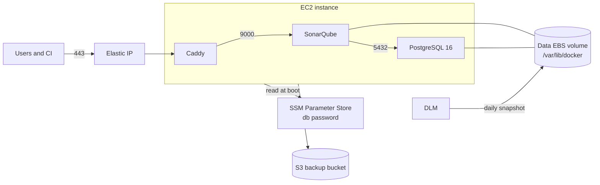

# Architecture

## Overview



Everything runs on one EC2 instance with Docker Compose. Caddy terminates TLS with automatic Let's Encrypt certificates and is the only container publishing ports.

## Network isolation

Compose defines two networks. PostgreSQL lives only on `backend` and is reachable only by SonarQube. SonarQube lives on `backend` and `frontend` and is reachable only by Caddy. The security group allows inbound 80 (ACME challenge and HTTPS redirect) and 443 only. Port 9000 is never exposed to the network.

## Instance access

There is no SSH. The security group has no port 22 and the module creates no key pair. Administration uses SSM Session Manager:

```bash
aws ssm start-session --target <instance-id>
```

IMDSv2 is required, protecting the instance role credentials from SSRF-style attacks.

## Secret flow

1. Terraform generates a random 40-character password and stores it as a SecureString parameter at `/<name>/db-password`.
2. The instance role is allowed `ssm:GetParameter` on that single parameter ARN.
3. At every boot, `render-env.sh` (an `ExecStartPre` of the systemd unit) fetches the password and writes `/opt/sonarqube/.env` with mode 600 on an encrypted volume.
4. Compose injects it into PostgreSQL and SonarQube.

The password never appears in user data, tfvars or instance tags. It does exist in the Terraform state, like any Terraform-managed secret; use an encrypted remote backend.

## Data volume design

A dedicated EBS volume is attached and mounted at `/var/lib/docker`, where all Docker named volumes live: PostgreSQL data, SonarQube data, extensions, logs and Caddy certificates. The root volume is disposable.

Consequences:

- Replacing the instance (AMI update, user data change, instance type change) keeps all state. The new instance mounts the existing volume, finds the existing filesystem (`mkfs` is guarded by a `blkid` check) and the stack comes back with all projects, users and certificates.
- The Elastic IP is a separate resource, so DNS never changes across replacements.
- DLM snapshots this single volume daily.

## Boot orchestration

cloud-init runs the user data once: kernel settings required by the embedded Elasticsearch (`vm.max_map_count`), volume mount, Docker install, file rendering and systemd unit installation. From then on `sonarqube.service` owns the lifecycle: it re-renders `.env` from SSM on every start and runs `docker compose up -d`. A systemd timer runs the daily database backup, scheduled one hour before the DLM snapshot so each snapshot contains the latest dump.
